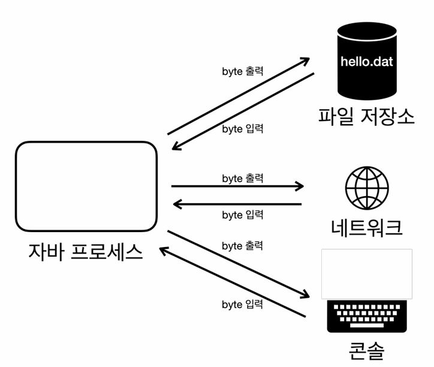

# JVM, JRE, JDK

<figure><figcaption></figcaption></figure>

## 1. JVM(Java Virtual Machine)

* 단독으로 배포되지 않는다.
* 자바 파일을 컴파일 해서 생긴 클래스파일(바이트코드)을 운영체제에 종속적인 코드로 변환하여 실행한다.\
  \-> 특정 운영체제에 _**종속적**_이라고 볼 수 있다..\

* JVM 벤터 : 오라클, 아마존, Azul...(다양하다..)
* 클래스를 읽어들이고, 메모리에 올리는 등 다양한 역할을 한다.

## 2. JRE(Java Runtime Enviroment)

* 최소 배포단위이다.
* 자바 애플리케이션을 실행하는 것이 목적이다.(코딩이 목적이 아니다..)
* 바이트 코드를 실행하기 위해서 JVM 이 필요하고, 필수적인 자바 문법을 사용하기 위한 라이브러리가 필요하다.
* 자바 개발 관련 도구는 포함하지 않는다.(개발 관련 도구는 JDK 에서 제공한다)

## 3. JDK(Java Development Kit)

* 자바 개발 도구
* 자바를 실행하기 위한 환경(JRE) 을 제공하고, 추가적으로 자바를 개발하기 위한 도구 또한 제공하는 것을 JDK 라고 부른다.
* 자바 11 부터는 JDK만 제공한다.(해당 버전부터 JDK 가 최소 배포단위이다)\
  \-> JRE 와 JDK 버전이 맞지 않으면 돌아가지 않는 이슈는 자바 11부터는 존재하지 않는다.

## 4. JVM 언어

* JVM 기반으로 동작하는 프로그래밍 언어.
* JVM 은 .java 파일이 아닌, .class 파일을 사용해서 실행시키기 때문에, .class 파일을 만들어주는 언어들에서 사용할 수 있다. \
  Ex) Java, Kotlin ...
