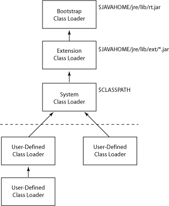

# STL 컨테이너 - Map

## Map

* **Key 를 통해 Value 를 저장하는 방식이다.**&#x20;
* Key 는 중복될 수 없다.&#x20;
* Key 가 기본적으로 오름차순으로 저장된다.&#x20;

### Map 만들기&#x20;

<figure><figcaption></figcaption></figure>

### Map 삽입

* std:pair\<iterator, bool> 을 리턴하게 된다. \
  \-> iterator, bool 쌍으로 리턴한다.&#x20;

<figure><figcaption></figcaption></figure>

* \[] 연산자를 통해서 key 에 대응하는 값을 참조로 반환할 수 있다.&#x20;
* **`"Coco"` 라는 키에 대응되는 값이 없을 때, `map["Coco"]` 로 읽는다고 하게되면 기본값이 들어간다.** \
  **-> 때문에, 읽기 연산을 조심해야 한다..**&#x20;

<figure><figcaption></figcaption></figure>

* 기본적으로 key 를 기준으로 자동 정렬한다.&#x20;

<figure><figcaption></figcaption></figure>

### Map 요소 찾기

<figure><figcaption></figcaption></figure>

<figure><figcaption></figcaption></figure>

### Map 요소 수정

<figure><figcaption></figcaption></figure>

<figure><figcaption></figcaption></figure>

## 개체를 Map 의 키로 사용해보자

#### 개체는 Map 의 키로 사용될 수 없다!

* **이전에 Map 의 키값은 기본적으로 정렬된다고 했는데, 그렇다면 기본적으로 키값은 비교될 수 있어야 한다.** \
  **-> 비교 연산자를 사용할 수 없다는 에러가 발생한다.**&#x20;

<figure><figcaption></figcaption></figure>

<figure><figcaption></figcaption></figure>

* 때문에, 두 키를 비교하는 함수를 만들어야 한다.**('<' 연산자 오버로딩)**\
  **-> 이후에 정상적으로 사용이 가능하다.**

<figure><figcaption></figcaption></figure>

## Map 의 장단점&#x20;

### 장점&#x20;

* **std::list 나 std::vector 보다 탐색 속도가 빠르다.**
  * `std::list, std::vector -> O(N)`
  * `std::map -> O(logN)`

### 단점&#x20;

* **자동으로 정렬된다..** \
  \-> 정렬이 필요한 경우라면 장점이 될 수 있다.&#x20;
* **해쉬맵(hashmap) 이 아님, 따라서 O(1) 이 아니다!**
* C++ 에 해결책이 있다!

